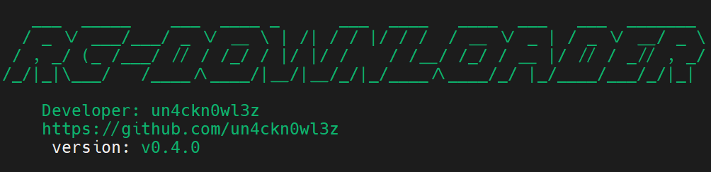

# rapidgator-downloader-rs
🚀 **The fastest Rapidgator premium account downloader written in Rust.**



This project allows you to download files from Rapidgator using a premium account with blazing speed and concurrency, leveraging Rust's performance and safety.

## 🔨 Prebuilt Binaries

| Platform | File | Download Link |
|----------|------|----------------|
| Windows (x86_64) | `rapidgator-downloader-rs-v0.4.0-windows-x86_64-release.zip` | [Download](https://github.com/un4ckn0wl3z/rapidgator-downloader-rs/releases/download/v0.4.0/rapidgator-downloader-rs-v0.4.0-windows-x86_64-release.zip) |
| Linux (x86_64) | `rapidgator-downloader-rs-v0.4.0-x86_64-unknown-linux-gnu-release.tar.gz` | [Download](https://github.com/un4ckn0wl3z/rapidgator-downloader-rs/releases/download/v0.4.0/rapidgator-downloader-rs-v0.4.0-x86_64-unknown-linux-gnu-release.tar.gz) |


## 🎥 Video Demo
[](https://youtu.be/Zm0i67-xFrM)


## ⚙️ Setup

### 1. Create a config file

Create a file named `config.yaml` in the root directory with the following structure:

```yaml
login: "404emailnotfound@internet.fail"
password: "passw0rd1shere"
max_concurrent_downloads: 5
target_dowload_path: "download"
```

Replace with your actual Rapidgator premium account credentials.

### 2. Create a download list
Create a file named `files.txt` in the root directory. Add one Rapidgator URL per line (support multi-files with multiple lines):

```txt
https://rapidgator.net/file/6bb392de829eaa4ef3fc73665b61a777/ProgrammingRust3rdEdition.Sanet.st.zip.html
```

## ▶️ Usage
To run the downloader:

```bash
cargo run --release
```
or
```bash
rapidgator-downloader-rs.exe
```
The program will:

- Authenticate with Rapidgator using your premium credentials

- Parse each URL from `files.txt`

- Download the files concurrently

- Concurrency limits

## 🛡 Disclaimer
This tool is for educational purposes only. You are responsible for complying with Rapidgator’s terms of service. Do not use this tool to download or distribute pirated or unauthorized content.

## LICENSE
WTFPL © [un4ckn0wl3z](https://github.com/un4ckn0wl3z)
